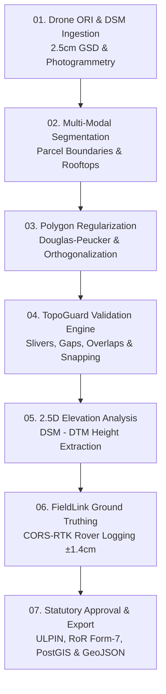

# CadastreAI (Nagar-Seema AI) 🗺️⚡

> **AI-Enabled Urban Cadastral Mapping, Automated Parcel Boundary Delineation & Land Records Modernization Platform**  
> *Developed for Smart India Hackathon (Problem ID: SIH 26012)*

[](https://react.dev/)
[](https://vitejs.dev/)
[](https://www.typescriptlang.org/)
[](https://tailwindcss.com/)
[](https://ai.google.dev/)
[](https://vercel.com/)
[](LICENSE)

---

## 📌 Overview

**CadastreAI (Nagar-Seema AI)** is an enterprise-grade GeoAI platform engineered to solve the complex challenges of urban cadastral surveys, legacy revenue map discrepancies, boundary disputes, and land record digitization under national initiatives such as **SVAMITVA** and **NLRMP / DILRMP**.

By processing high-resolution drone orthomosaics (ORI, 2.5 cm GSD) and Digital Surface / Terrain Models (DSM/DTM), the platform extracts parcel boundaries, segments building footprints, validates planar topology, flags encroachments, directs CORS-RTK GNSS ground truth surveyors, and issues statutory land records with 14-digit **ULPIN (Bhu-Aadhaar)** numbers.

---

## 🚀 Key Functional Modules

| Module | Core Purpose & Capabilities |
|---|---|
| **01. ParcelVision** | Semantic segmentation of physical boundary markers (hedges, compound walls, fences, parcel dividers) using deep edge-preserving vision models. |
| **02. UrbanFeature AI** | Building footprint extraction, rooftop delineation, and 2.5D height calculation from DSM/DTM elevation layers ($Z_{\text{elev}}$). |
| **03. TopoGuard** | Automated planar graph topology validation (zero overlapping polygons, sliver gap detection, self-intersections, legal setback enforcement, and automated snap-to-shared-node algorithms). |
| **04. FieldLink** | Risk-based targeted ground truthing queue; directs field surveyors to high-discrepancy zones using CORS-RTK GNSS rovers ($\pm 1.4\text{ cm}$ precision). |
| **05. WebGIS Workbench** | Interactive 2D canvas with pan/zoom inertia, split-screen swipe comparison (legacy cadastral sheets vs. AI orthomosaics), parcel subdivision, and 4-stage statutory review lifecycle (**AI Suggestion → Surveyor Review → Supervisor Approval → GIS Export Ready**). |
| **06. GeoExport Hub** | Multi-format spatial export supporting OGC GeoJSON, PostGIS Spatial SQL (`EPSG:32643`), RoR (Record of Rights / Form-7 CSV), and ULPIN registry schema. |
| **07. SIH Presentation Deck** | Built-in interactive 6-slide executive presentation modal summarizing problem statement, technical approach, feasibility matrix, quantitative impact, and academic references. |

---

## 🔬 End-to-End 7-Stage Geospatial AI Pipeline



1. **Ingestion & Pre-processing**: Orthorectified Imagery (ORI) + DSM/DTM layers aligned to WGS 84 / UTM Zone 43N (`EPSG:32643`).
2. **Multi-Task Feature Extraction**: Parallel segmentation of boundaries, building polygons, and road corridors.
3. **Geometry Regularization**: Simplification and orthogonalization of raw pixel boundaries into compliant cadastral polygons.
4. **Topology Enforcement**: Validation against statutory planar graph rules with automated vertex snapping.
5. **3D Height & FAR Estimation**: Calculation of building heights ($H = Z_{\text{DSM}} - Z_{\text{DTM}}$), footprint areas, and land-use classification.
6. **Discrepancy Auditing & Field Verification**: Multi-modal GeoAI audit via Gemini 3.8 Flash identifying boundary encroachments and assigning rover checkpoints.
7. **Statutory Finalization**: 4-stage administrative sign-off and multi-format spatial export.

---

## 🛠️ Complete Technology Stack

### Frontend Architecture
- **Framework**: [React 19](https://react.dev/) (`19.0.1`)
- **Build System**: [Vite 6](https://vitejs.dev/) (`6.2.3`)
- **Language**: [TypeScript 5.8](https://www.typescriptlang.org/) (`~5.8.2`)
- **Styling**: [Tailwind CSS v4](https://tailwindcss.com/) (`@tailwindcss/vite` `4.1.14`)
- **Animations**: [Motion](https://motion.dev/) (`motion/react` `12.23.24`)
- **Icons**: [Lucide React](https://lucide.react.dev/) (`0.546.0`)

### Spatial & GIS Capabilities
- **Coordinate Reference Systems**:
  - Projected: **EPSG:32643** (WGS 84 / UTM Zone 43N, Metric Easting/Northing)
  - Geographic: **EPSG:4326** (WGS 84 Latitude/Longitude with real-time inverse projection)
- **Canvas Rendering Engine**: Sub-pixel affine transformation ($X, Y, \text{scale}$), boundary vertex drag editing, interactive measurement HUD, and split-view comparative swipe renderer.
- **Standards Compliance**: Open Geospatial Consortium (OGC) GeoJSON, ISO 19152 Land Administration Domain Model (LADM), and Ministry of Rural Development ULPIN guidelines.

### Backend & AI Architecture (Dual Deployment)
- **AI Model**: **Google Gemini 3.8 Flash** (`@google/genai` `^2.4.0`)
- **Serverless Architecture**: Native `/api` serverless endpoints for **Vercel** (`/api/health.ts`, `/api/ai/cadastral-audit.ts`).
- **Container / Standalone Architecture**: Express 5 server (`server.ts`) for Docker containers and Google Cloud Run.
- **Offline / Fallback Resilience**: Built-in GeoAI rule engine that ensures full system functionality even when an external API key is unconfigured.

---

## 📂 Repository Structure

```
cadastre-ai/
├── api/                             # Vercel Serverless Functions
│   ├── _gemini.ts                   # Core GeoAI logic & Gemini 3.8 Flash SDK client
│   ├── health.ts                    # GET /api/health (service health & diagnostic endpoint)
│   ├── cadastral-audit.ts           # POST /api/cadastral-audit
│   └── ai/
│       └── cadastral-audit.ts       # POST /api/ai/cadastral-audit (body streaming & CORS)
├── public/                          # Static assets and icons
├── src/                             # React 19 Frontend
│   ├── components/
│   │   ├── ai/                      # GeoAI audit modal, prompt workbench & insights
│   │   ├── dsm/                     # DSM/DTM elevation profiles & height inspectors
│   │   ├── gis/                     # Spatial export modal (GeoJSON, PostGIS SQL, RoR)
│   │   ├── gt/                      # FieldLink ground truthing rover queue & GPS sync
│   │   ├── inspector/               # Parcel property inspector & attribute editor
│   │   ├── reports/                 # Printable statutory survey summary sheets
│   │   ├── sih/                     # SIH 26012 6-Slide presentation deck modal
│   │   └── topology/                # TopoGuard error matrix & automated fixes
│   ├── data/                        # Sample urban survey datasets & revenue records
│   ├── types/                       # Cadastral, GIS, and spatial TypeScript interfaces
│   ├── utils/                       # Geometry math, coordinate projections & conversions
│   ├── App.tsx                      # Primary Workbench UI & state coordinator
│   ├── index.css                    # Tailwind CSS v4 entry point (@import "tailwindcss";)
│   └── main.tsx                     # React DOM entry point
├── .env.example                     # Environment variable declarations
├── index.html                       # Single-page application entry point (at repo root)
├── metadata.json                    # Application metadata and platform capabilities
├── package.json                     # Dependencies, scripts and package declarations
├── server.ts                        # Express server for container / Cloud Run deployment
├── tsconfig.json                    # TypeScript compiler configuration
├── vercel.json                      # Vercel deployment configuration (routes & rewrites)
└── vite.config.ts                   # Vite configuration
```

---

## ⚡ Getting Started (Local Development)

### Prerequisites
- **Node.js**: v18.0.0 or higher (v20+ recommended)
- **npm**: v9.0.0 or higher

### 1. Clone the repository
```bash
git clone https://github.com/your-username/cadastre-ai.git
cd cadastre-ai
```

### 2. Install dependencies
```bash
npm install
```

### 3. Configure environment variables (Optional)
Copy `.env.example` to `.env`:
```bash
cp .env.example .env
```
Add your Gemini API key:
```env
GEMINI_API_KEY=your_google_gemini_api_key_here
```
*(Note: If no key is provided, the platform automatically engages its built-in rule-engine fallback so all features remain functional).*

### 4. Run the development server
```bash
npm run dev
```
Open [http://localhost:3000](http://localhost:3000) in your browser.

### 5. Build for production
```bash
npm run build
```
Compiled static assets are generated in the `dist/` directory.

---

## ☁️ Deployment Guide

This project is built with a **dual deployment architecture**: it can run on **Vercel** as a serverless application or inside a **Docker container / Cloud Run** using `server.ts`.

### Option A: Deploying to Vercel (Recommended)

1. Push your repository to **GitHub / GitLab / Bitbucket**.
2. Go to [Vercel Dashboard](https://vercel.com/new) and click **Import**.
3. Select your repository.
4. Verify the deployment settings:
   - **Framework Preset**: `Vite`
   - **Root Directory**: `./` *(ensure this points to the folder containing `package.json` and `index.html`)*
   - **Build Command**: `vite build`
   - **Output Directory**: `dist`
   - **Install Command**: `npm install`
5. Under **Environment Variables**, add:
   - `GEMINI_API_KEY`: `your_api_key` *(optional, rule engine fallback used if omitted)*
6. Click **Deploy**. Vercel will automatically build the React SPA and deploy all `/api/*` serverless functions.

#### ⚠️ Common Vercel Deployment Troubleshooting

| Error | Root Cause | Solution |
|---|---|---|
| `ENOENT: Could not read package.json` | Vercel's **Root Directory** setting points to a non-existent subfolder or is mistyped. | In Vercel Project Settings $\rightarrow$ General, set Root Directory to the folder where `package.json` lives (or leave empty if at the repository root). |
| `Could not resolve entry module "index.html"` | `index.html` was placed inside `public/` or was not committed to the root. | Ensure `index.html` is located directly in the root directory alongside `package.json` and `git push`. |

---

### Option B: Deploying to Docker / Cloud Run

To run in a container environment using the bundled Node.js server:

1. Build the frontend and bundle the backend:
```bash
npm run build
```
2. Start the production server:
```bash
npm start
```
The server binds to `0.0.0.0:3000`.

---

## 📡 API Reference

### 1. Service Health Check
```http
GET /api/health
```
**Response:**
```json
{
  "status": "ok",
  "service": "CadastreAI GeoAI Engine (Serverless / Vercel Ready)",
  "hasGeminiKey": true,
  "environment": "production",
  "timestamp": "2026-09-16T16:15:00.000Z"
}
```

### 2. Cadastral Boundary & Encroachment Audit
```http
POST /api/ai/cadastral-audit
Content-Type: application/json
```
**Request Body:**
```json
{
  "parcelData": {
    "id": "P-104",
    "owner": "Ramesh Chandra Sharma",
    "areaSqm": 412.5,
    "ulpin": "27-043-104-9821"
  },
  "layerContext": {
    "crs": "EPSG:32643",
    "hasEncroachmentFlag": true
  },
  "userQuery": "Verify building setback against corridor R-02"
}
```
**Response:**
```json
{
  "success": true,
  "modelUsed": "gemini-3.8-flash",
  "summary": "Building footprint B-104-A encroaches 1.42m across the eastern boundary into the public right-of-way.",
  "findings": [
    {
      "type": "encroachment",
      "severity": "high",
      "parcelId": "P-104",
      "description": "Building footprint exceeds surveyed cadastral boundary by 1.42m.",
      "recommendedAction": "Issue FieldLink GNSS rover verification task."
    }
  ],
  "confidenceScore": 0.96,
  "groundTruthRecommendations": [
    "Verify benchmark BM-04 at intersection of North Road & 12th Cross."
  ]
}
```

---

## 📜 Statutory & Technical Standards

- **ULPIN (Unique Land Parcel Identification Number)**: Generates 14-digit standardized alphanumeric IDs based on centroid longitude and latitude (Bhu-Aadhaar).
- **ISO 19152 (LADM)**: Structural alignment with international standards for Land Administration Domain Models.
- **SVAMITVA Scheme**: Direct compatibility with Ministry of Panchayati Raj drone survey workflows.
- **OGC Compliant**: Export outputs validated against standard Open Geospatial Consortium specifications.

---

## 📄 License

This project is licensed under the **MIT License** - see the [LICENSE](LICENSE) file for details.
